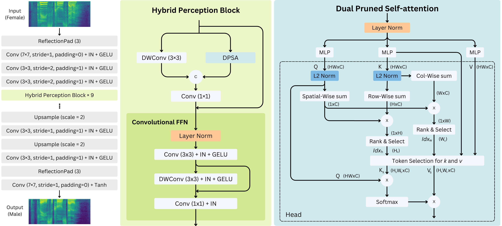

# Official PyTorch implementation of ATTR: A Transformer-Based Model for Unpaired Audio-to-Audio Translation.

## Overview
This repository provides the official implementation of the ATTR model for unpaired audio-to-audio translation, as introduced in our paper:

### [Paper](https://zenodo.org/records/17231425)

ATTR is the result of an independent research project focused on unpaired audio-to-audio translation for conversational AI systems. Although initially submitted to IWSLT-2025 and not accepted, I believe the model and findings may offer useful insights to the community.

<p align="center">
  
</p>

This implementation is based on [CVC](https://github.com/Tinglok/CVC). Special thanks to Tinglok for sharing the code.

## Prerequisites
- **Operating System:** Windows, Linux or macOS
- **Python Version:** Python 3.x
- **Hardware:** CPU or NVIDIA GPU with CUDA & CuDNN

## Installation
### Clone the Repository
```bash
git clone https://github.com/Maharnab-Saikia/ATTR
cd ATTR
```

### Install Dependencies
- **For pip users:**
```bash
pip install -r requirements.txt
```
- **For Conda users:**
```bash
conda env create -f environment.yaml
```

### Download Pre-trained Vocoder
Download the pre-trained [Parallel WaveGAN](https://drive.google.com/drive/folders/1qoocM-VQZpjbv5B-zVJpdraazGcPL0So?usp=drive_open) vocoder and place it in the `./checkpoints/vocoder/` directory.

---

## Training and Testing

### Dataset Preparation
Download the **VCTK** dataset:
```bash
wget http://datashare.is.ed.ac.uk/download/DS_10283_2651.zip
unzip DS_10283_2651.zip
unzip VCTK-Corpus.zip
mkdir dataset
cp -r ./VCTK-Corpus/wav48/p* ./datasets/trainA
cp -r ./VCTK-Corpus/wav48/p* ./datasets/trainB
```

### Train the ATTR Model
Run the following command to train the model:
```bash
python train.py --dataroot ./datasets --name ATTR
```
Checkpoints will be saved in `./checkpoints/ATTR/`.

### Test the ATTR Model
```bash
python test.py --dataroot ./datasets --validation_A_dir ./datasets/trainA --output_A_dir ./checkpoints/ATTR/converted_sound
```

Converted audio samples will be saved in `./checkpoints/ATTR/converted_sound/`.

---

## Citation
If you use this code for your research, please cite our [paper](https://zenodo.org/records/17231425).

```
@misc{saikia2025attr,
  author       = {Maharnab Saikia},
  title        = {ATTR: A Transformer-Based Model for Unpaired Audio-to-Audio Translation},
  year         = {2025},
  publisher    = {Zenodo},
  doi          = {10.5281/zenodo.17231425},
  url          = {https://doi.org/10.5281/zenodo.17231425}
}
```
